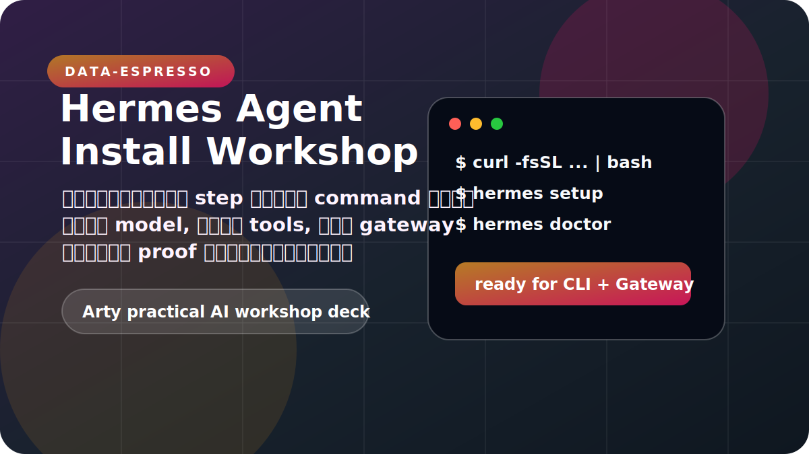
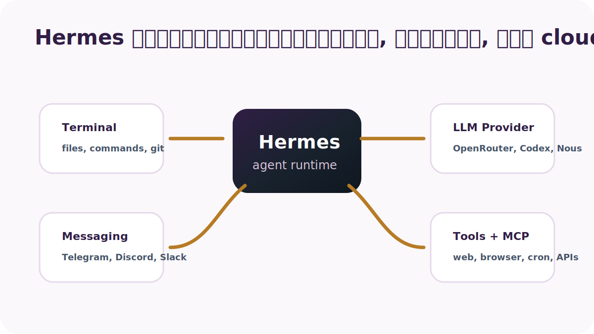
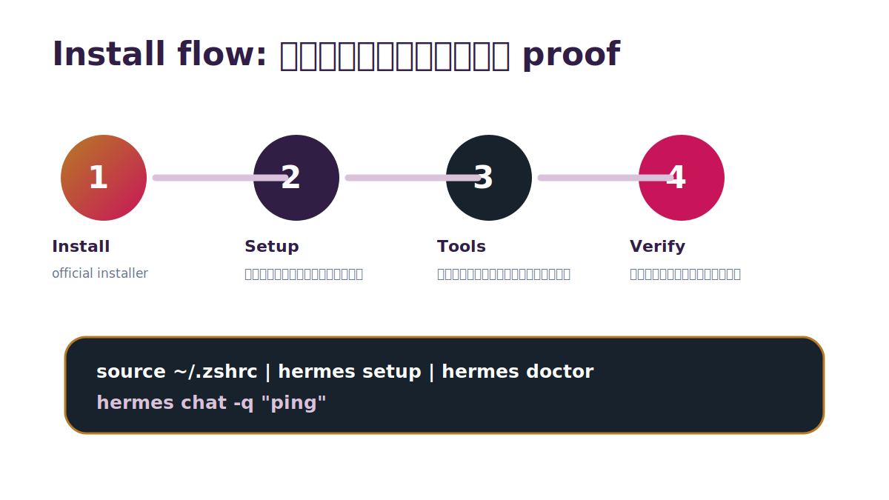
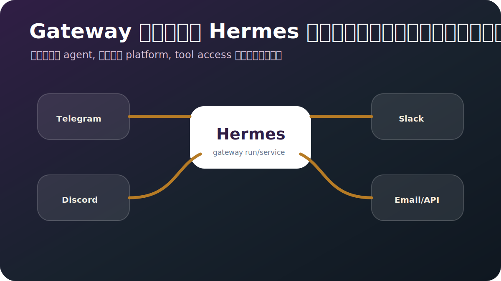
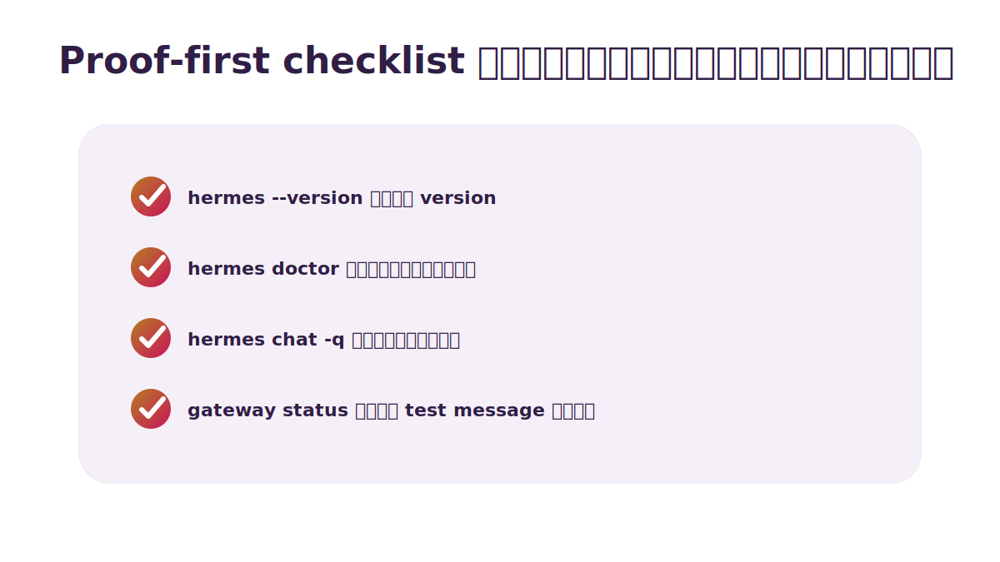

---
layout: section
---

# เป้าหมายของ session

ไม่ใช่แค่ติดตั้งให้ผ่าน แต่ทำให้ทุกคนมี Hermes ที่พิสูจน์ได้ว่าใช้งานจริง

---

<div class="de-slide-header">
  <div class="de-slide-index">01 · What learners will build</div>
  <div class="de-kicker">Outcome first</div>
</div>

<div class="de-two-up">
  <div class="de-list-card">
    <h2>หลังจบต้องทำได้จริง</h2>
    <ul>
      <li>ติดตั้ง Hermes บน macOS, Linux, หรือ WSL2 ได้เอง</li>
      <li>ตั้งค่า provider/model ผ่าน <code>hermes setup</code> โดยไม่เดา</li>
      <li>เปิด tools ที่จำเป็นกับ workflow จริง ไม่เปิดมั่ว</li>
      <li>ใช้ <code>hermes doctor</code> อ่านปัญหาเป็น</li>
      <li>ต่อ Telegram/Discord/Slack แล้วให้ agent ทำงานใน channel ได้</li>
    </ul>
  </div>
  <div class="de-panel-dark">
    <h2>Arty rule</h2>
    <p>อย่าสอนให้จำ command อย่างเดียวครับ สอนให้ทุก step มี proof: install → configure → verify → ค่อยเอาไปใช้ในงานจริง.</p>
  </div>
</div>

---

<div class="de-slide-header">
  <div class="de-slide-index">02 · Mental model</div>
  <div class="de-kicker">Architecture</div>
</div>



---

<div class="de-slide-header">
  <div class="de-slide-index">03 · Prerequisites</div>
  <div class="de-kicker">Before install</div>
</div>

<div class="de-table-card">
  <table>
    <thead><tr><th>สิ่งที่ต้องมี</th><th>ทำไมต้องมี</th><th>เช็กเร็ว</th></tr></thead>
    <tbody>
      <tr><td>macOS, Linux, WSL2</td><td>ต้องมี terminal ที่ Hermes รันได้จริง</td><td><code>uname -a</code></td></tr>
      <tr><td>Git + shell</td><td>installer ต้อง clone/update และผูก PATH</td><td><code>git --version</code></td></tr>
      <tr><td>LLM account/key</td><td>ไม่มี model ก็เหมือนมีรถแต่ไม่มีน้ำมัน</td><td>OpenRouter, Codex, Nous, Anthropic</td></tr>
      <tr><td>Messaging bot token</td><td>ค่อยใช้ตอนจะพา agent เข้าทีมจริง</td><td>Telegram BotFather หรือ Discord Portal</td></tr>
    </tbody>
  </table>
</div>

---

<div class="de-slide-header">
  <div class="de-slide-index">04 · Installation flow</div>
  <div class="de-kicker">Follow the path</div>
</div>



---

<div class="de-slide-header">
  <div class="de-slide-index">05 · One-line installer</div>
  <div class="de-kicker">Linux / macOS / WSL2</div>
</div>

<div class="de-two-up de-command-slide">
  <div class="de-list-card">
    <h2>คำสั่งหลักที่ต้องกล้ารัน</h2>

```bash
BASE="https://raw.githubusercontent.com"
REPO="NousResearch/hermes-agent"
curl -fsSL "$BASE/$REPO/main/scripts/install.sh" | bash
```

  </div>
  <div class="de-panel-dark">
    <h2>อย่าให้ผู้เรียน copy แบบหลับตา</h2>
    <ul>
      <li>ชี้ให้เห็นว่าโหลดจาก GitHub official repo</li>
      <li>อธิบายว่า installer วาง CLI + dependency ให้</li>
      <li>จบด้วย reload shell แล้วเช็ก <code>hermes --version</code></li>
    </ul>
  </div>
</div>

---

<div class="de-slide-header">
  <div class="de-slide-index">06 · Reload shell</div>
  <div class="de-kicker">PATH check</div>
</div>

<div class="de-two-up">
  <div class="de-soft-panel">

```bash
source ~/.zshrc
# หรือ
source ~/.bashrc

hermes --version
```

  </div>
  <div class="de-list-card">
    <h2>ถ้า command not found อย่า panic</h2>
    <ul>
      <li>ปิด terminal แล้วเปิดใหม่ก่อน ง่ายสุด</li>
      <li>เช็กว่า installer เพิ่ม PATH ใน shell rc แล้วหรือยัง</li>
      <li>รัน <code>which hermes</code> เพื่อดูว่าเครื่องหา binary เจอไหม</li>
    </ul>
  </div>
</div>

---
layout: section
---

# ตั้งค่า Hermes ครั้งแรก

จุดนี้คือเปลี่ยนจาก “ลงโปรแกรมแล้ว” เป็น “agent เริ่มทำงานได้จริง”

---

<div class="de-slide-header">
  <div class="de-slide-index">07 · Setup wizard</div>
  <div class="de-kicker">First run</div>
</div>

<div class="de-two-up">
  <div class="de-list-card">
    <h2>เริ่มจาก wizard ไม่ต้องเก่ง config</h2>

```bash
hermes setup
hermes model
hermes config
```

  </div>
  <div class="de-panel-dark">
    <h2>สิ่งที่ wizard ช่วยเคลียร์</h2>
    <ul>
      <li>จะใช้ provider ไหน และจ่ายเงิน/ล็อกอินตรงไหน</li>
      <li>model default ควรเป็นตัวไหนสำหรับงานเรา</li>
      <li>จะให้ agent แตะ terminal/tools ได้แค่ไหน</li>
      <li>gateway หรือ voice จำเป็นตอนนี้ไหม หรือไว้ทีหลัง</li>
    </ul>
  </div>
</div>

---

<div class="de-slide-header">
  <div class="de-slide-index">08 · Provider choices</div>
  <div class="de-kicker">Pick based on workflow</div>
</div>

<div class="de-table-card">
  <table>
    <thead><tr><th>Provider</th><th>เหมาะกับ</th><th>หมายเหตุ</th></tr></thead>
    <tbody>
      <tr><td>OpenAI Codex</td><td>งาน coding, repo, review</td><td>เหมาะถ้าทีมใช้ CLI agent หนัก</td></tr>
      <tr><td>OpenRouter</td><td>อยากเลือก model หลายค่าย</td><td>ดีสำหรับทดลองและเทียบ cost/quality</td></tr>
      <tr><td>Nous Portal</td><td>ใช้งานกับ ecosystem ของ Nous</td><td>เหมาะกับลอง Hermes แบบ native</td></tr>
      <tr><td>Custom endpoint</td><td>องค์กรมี model gateway เอง</td><td>ต้องเป๊ะเรื่อง base URL/key ไม่งั้นพังเงียบ</td></tr>
    </tbody>
  </table>
</div>

---

<div class="de-slide-header">
  <div class="de-slide-index">09 · Login and keys</div>
  <div class="de-kicker">Secrets stay local</div>
</div>

<div class="de-two-up">
  <div class="de-soft-panel">

```bash
hermes login --provider openai-codex
hermes auth list
hermes config env-path
```

  </div>
  <div class="de-list-card">
    <h2>Security habit ที่ต้องย้ำ</h2>
    <ul>
      <li>API keys อยู่ใน <code>~/.hermes/.env</code></li>
      <li>config อยู่ใน <code>~/.hermes/config.yaml</code></li>
      <li>secret ไม่ใช่ของโชว์ครับ ห้าม paste ลง slide, repo, หรือ group chat</li>
    </ul>
  </div>
</div>

---

<div class="de-slide-header">
  <div class="de-slide-index">10 · Tools and toolsets</div>
  <div class="de-kicker">Capability switchboard</div>
</div>

<div class="de-metric-grid">
  <div class="de-metric"><div class="label">Core</div><div class="value">terminal + file</div><div>ให้ agent อ่านไฟล์ แก้ไฟล์ รัน test และ build ได้</div></div>
  <div class="de-metric"><div class="label">Research</div><div class="value">web + browser</div><div>ค้นข้อมูล เปิดเว็บ และเก็บ evidence แทนการเดา</div></div>
  <div class="de-metric"><div class="label">Ops</div><div class="value">cron + send</div><div>ตั้งงานอัตโนมัติ แล้วส่งผลกลับมาหาเรา</div></div>
</div>

---

<div class="de-slide-header">
  <div class="de-slide-index">11 · Enable tools safely</div>
  <div class="de-kicker">Tool governance</div>
</div>

<div class="de-two-up">
  <div class="de-list-card">
    <h2>คำสั่งที่ควรรู้</h2>

```bash
hermes tools list
hermes tools enable web
hermes tools enable terminal
hermes tools disable homeassistant
```

  </div>
  <div class="de-panel-dark">
    <h2>Rule of thumb</h2>
    <p>เปิด tools เท่าที่ workflow ต้องใช้จริงพอครับ ยิ่ง agent อยู่ใน group chat ยิ่งต้องระวัง tools ที่มี side effect เช่น email, social, home control.</p>
  </div>
</div>

---

<div class="de-slide-header">
  <div class="de-slide-index">12 · Memory and skills</div>
  <div class="de-kicker">Learning loop</div>
</div>

<div class="de-two-up">
  <div class="de-list-card">
    <h2>Memory จำ “บริบท”</h2>
    <ul>
      <li>ชื่อ, timezone, preference</li>
      <li>project conventions ที่ใช้ซ้ำ</li>
      <li>tool quirks ที่เจอแล้วไม่ควรลืม</li>
    </ul>
  </div>
  <div class="de-panel-dark">
    <h2>Skills จำ “วิธีทำงาน”</h2>
    <ul>
      <li>ขั้นตอน deploy</li>
      <li>workflow debug</li>
      <li>คำสั่งและ pitfalls เฉพาะงาน</li>
    </ul>
  </div>
</div>

---
layout: section
---

# เปิด Messaging Gateway

นี่คือจุดที่ Hermes ไม่ได้อยู่แค่ใน terminal แต่เริ่มเป็นเพื่อนร่วมทีมใน channel จริง

---

<div class="de-slide-header">
  <div class="de-slide-index">13 · Gateway map</div>
  <div class="de-kicker">Messaging layer</div>
</div>



---

<div class="de-slide-header">
  <div class="de-slide-index">14 · Gateway setup</div>
  <div class="de-kicker">Interactive setup</div>
</div>

<div class="de-two-up">
  <div class="de-soft-panel">

```bash
hermes gateway setup
hermes gateway run
hermes gateway status
```

  </div>
  <div class="de-list-card">
    <h2>แนะนำให้เริ่มแบบนี้</h2>
    <ul>
      <li>run foreground ก่อน จะได้เห็น log ตอนพัง</li>
      <li>ทดสอบ mention/message จาก platform จริง</li>
      <li>ค่อย install เป็น background service เมื่อมั่นใจแล้ว</li>
    </ul>
  </div>
</div>

---

<div class="de-slide-header">
  <div class="de-slide-index">15 · Telegram setup</div>
  <div class="de-kicker">Practical path</div>
</div>

<div class="de-table-card">
  <table>
    <thead><tr><th>Step</th><th>Action</th><th>Evidence</th></tr></thead>
    <tbody>
      <tr><td>1</td><td>สร้าง bot ผ่าน BotFather</td><td>ได้ bot token เก็บให้ปลอดภัย</td></tr>
      <tr><td>2</td><td>ใส่ token ใน gateway setup</td><td>config/env ถูก update</td></tr>
      <tr><td>3</td><td>เพิ่ม bot เข้า chat หรือ group</td><td>bot เห็นข้อความจริง</td></tr>
      <tr><td>4</td><td>ลองถามแบบสั้นและดู log</td><td>Hermes ตอบกลับพร้อมใช้ tools</td></tr>
    </tbody>
  </table>
</div>

---

<div class="de-slide-header">
  <div class="de-slide-index">16 · Discord setup pitfall</div>
  <div class="de-kicker">Avoid blocked startup</div>
</div>

<div class="de-two-up">
  <div class="de-list-card">
    <h2>ค่าที่ควรระวัง</h2>
    <ul>
      <li>ถ้าไม่ได้ resolve username ไม่ควรเปิด privileged Members intent</li>
      <li>ตั้ง <code>require_mention: true</code> ใน server/group ที่ bot เห็นทุก message</li>
      <li>ถ้า bot online แต่ไม่ตอบ อย่าเดา เปิด log ก่อน</li>
    </ul>
  </div>
  <div class="de-panel-dark">
    <h2>Good default</h2>
    <p>เริ่มจากให้ Hermes ตอบเมื่อถูก mention ก่อนครับ แล้วค่อย whitelist channel ที่ต้องการให้ free response จริง ๆ.</p>
  </div>
</div>

---
layout: section
---

# Verification และ troubleshooting

อย่าจบด้วยคำว่า “น่าจะได้” ให้จบด้วยหลักฐานว่า agent ทำงานได้จริง

---

<div class="de-slide-header">
  <div class="de-slide-index">17 · Proof-first checklist</div>
  <div class="de-kicker">Verify before celebrate</div>
</div>



---

<div class="de-slide-header">
  <div class="de-slide-index">18 · Smoke tests</div>
  <div class="de-kicker">Fast checks</div>
</div>

<div class="de-two-up">
  <div class="de-soft-panel">

```bash
hermes doctor
hermes status --all
hermes chat -q "ตอบว่า Hermes พร้อมใช้งาน"
hermes tools list
```

  </div>
  <div class="de-list-card">
    <h2>ตีความผลลัพธ์แบบคนทำงานจริง</h2>
    <ul>
      <li>doctor บอก dependency/config ที่ยังขาด</li>
      <li>status ช่วยดู gateway/service ว่ายังหายใจอยู่ไหม</li>
      <li>chat smoke test ยืนยันว่า provider ใช้งานได้ ไม่ใช่แค่ตั้งค่าไว้สวย ๆ</li>
    </ul>
  </div>
</div>

---

<div class="de-slide-header">
  <div class="de-slide-index">19 · Troubleshooting map</div>
  <div class="de-kicker">Common failures</div>
</div>

<div class="de-table-card">
  <table>
    <thead><tr><th>อาการ</th><th>สาเหตุที่พบบ่อย</th><th>ทางแก้เร็ว</th></tr></thead>
    <tbody>
      <tr><td><code>hermes</code> not found</td><td>PATH ยังไม่ reload</td><td><code>source ~/.zshrc</code> หรือเปิด terminal ใหม่</td></tr>
      <tr><td>model call fail</td><td>key/login ไม่พร้อม</td><td><code>hermes login</code>, เช็ก <code>.env</code></td></tr>
      <tr><td>tool ไม่ขึ้น</td><td>toolset ปิดอยู่หรือ missing env</td><td><code>hermes tools list</code> ก่อนเดา</td></tr>
      <tr><td>gateway ไม่ตอบ</td><td>token/permission/mention rule</td><td>ดู <code>~/.hermes/logs/gateway.log</code></td></tr>
    </tbody>
  </table>
</div>

---

<div class="de-slide-header">
  <div class="de-slide-index">20 · Operating checklist</div>
  <div class="de-kicker">After install</div>
</div>

<div class="de-metric-grid">
  <div class="de-metric"><div class="label">Weekly</div><div class="value">update</div><div>เช็ก <code>hermes update</code> เมื่อมี feature หรือ bugfix ที่ต้องใช้จริง</div></div>
  <div class="de-metric"><div class="label">Every change</div><div class="value">backup</div><div>ก่อนแก้ config สำคัญ เก็บ diff หรือ backup ไว้ก่อน</div></div>
  <div class="de-metric"><div class="label">Always</div><div class="value">logs</div><div>เวลาพัง เริ่มจาก logs และ doctor ไม่เดาเอาเองครับ</div></div>
</div>

---
layout: section
---

# Workshop exercise

ให้ผู้เรียนลงมือทำและส่ง proof กลับมา ไม่ใช่นั่งดู demo แล้วพยักหน้า

---

<div class="de-slide-header">
  <div class="de-slide-index">21 · Hands-on script</div>
  <div class="de-kicker">30-minute lab</div>
</div>

<div class="de-table-card">
  <table>
    <thead><tr><th>เวลา</th><th>กิจกรรม</th><th>Output</th></tr></thead>
    <tbody>
      <tr><td>0-5 นาที</td><td>เช็ก OS, shell, git</td><td>รู้ว่าเครื่องพร้อมหรือยัง</td></tr>
      <tr><td>5-12 นาที</td><td>รัน installer และ reload shell</td><td><code>hermes --version</code></td></tr>
      <tr><td>12-22 นาที</td><td>ตั้ง provider/model</td><td><code>hermes chat -q</code> ผ่าน</td></tr>
      <tr><td>22-30 นาที</td><td>เปิด toolset + doctor</td><td>screenshot หรือ paste proof แบบไม่โชว์ secret</td></tr>
    </tbody>
  </table>
</div>

---

<div class="de-slide-header">
  <div class="de-slide-index">22 · Proof submission</div>
  <div class="de-kicker">What learners send back</div>
</div>

<div class="de-two-up">
  <div class="de-list-card">
    <h2>ขอ proof 4 อย่าง</h2>
    <ul>
      <li><code>hermes --version</code></li>
      <li><code>hermes doctor</code> จุดสำคัญผ่าน</li>
      <li><code>hermes chat -q "ping"</code> มีคำตอบ</li>
      <li>ถ้าเปิด gateway: screenshot จาก Telegram/Discord</li>
    </ul>
  </div>
  <div class="de-panel-dark">
    <h2>Safe proof</h2>
    <p>เวลา verify ให้แชร์เฉพาะ output ที่ไม่เปิดเผย secret ครับ ห้ามโชว์ API key หรือ config ทั้งไฟล์เด็ดขาด.</p>
  </div>
</div>

---

<div class="de-slide-header">
  <div class="de-slide-index">23 · Publish flow</div>
  <div class="de-kicker">How this deck is published</div>
</div>

<div class="de-two-up">
  <div class="de-list-card">
    <h2>Slidev → static site → Coolify</h2>
    <ul>
      <li>deck อยู่ใน <code>decks/hermes-install-workshop.md</code></li>
      <li>build ด้วย <code>npm run build</code></li>
      <li>Coolify serve static output ด้วย nginx container</li>
      <li>push ไป GitHub แล้ว Coolify redeploy</li>
    </ul>
  </div>
  <div class="de-panel-dark">
    <h2>Why static</h2>
    <p>สำหรับ slide ที่ใช้สอนหรือส่งลูกค้า static mode ปลอดภัยกว่า dev/editor mode เพราะไม่มี write endpoint เปิด public.</p>
  </div>
</div>

---
layout: end
---

# Key takeaway

ติดตั้ง Hermes สำเร็จ ไม่ใช่แค่พิมพ์ <code>hermes</code> แล้วขึ้นครับ ต้องมี proof ว่า agent คิดได้, ใช้ tools ได้, และอยู่ใน channel ที่ทีมใช้งานจริงได้อย่างปลอดภัย

<div class="de-hero-meta">
  <div class="de-chip">Install</div>
  <div class="de-chip">Configure</div>
  <div class="de-chip">Verify</div>
  <div class="de-chip">Operate</div>
</div>

<style>
.de-visual-full {
  position: absolute;
  inset: 0;
  width: 100%;
  height: 100%;
  object-fit: cover;
}
.de-visual-card {
  display: block;
  width: auto;
  max-width: 100%;
  height: 420px;
  margin-left: auto;
  margin-right: auto;
  object-fit: contain;
  border-radius: 28px;
  box-shadow: 0 24px 70px rgba(24, 34, 45, 0.15);
}
.slidev-layout:has(.de-visual-full) {
  padding: 0;
}
.slidev-layout pre {
  font-size: 0.76rem;
  line-height: 1.5;
}
.de-command-slide {
  grid-template-columns: minmax(0, 1.08fr) minmax(0, 0.92fr);
  gap: 1.1rem;
}
.de-command-slide > * {
  min-width: 0;
}
.de-command-slide .de-list-card,
.de-command-slide .de-panel-dark {
  min-height: 12.2rem;
}
.de-command-slide .de-list-card {
  overflow: hidden;
}
.de-command-slide pre {
  max-width: 100%;
  overflow-x: auto;
  white-space: pre;
}
.de-command-slide .de-panel-dark h2 {
  font-size: 1.62rem;
}
.de-command-slide .de-panel-dark ul {
  padding-left: 1rem;
}
.de-command-slide .de-panel-dark li {
  font-size: 0.92rem;
  line-height: 1.45;
  overflow-wrap: normal;
}
.de-architecture-card {
  height: 400px;
  margin-top: -0.25rem;
}
</style>
